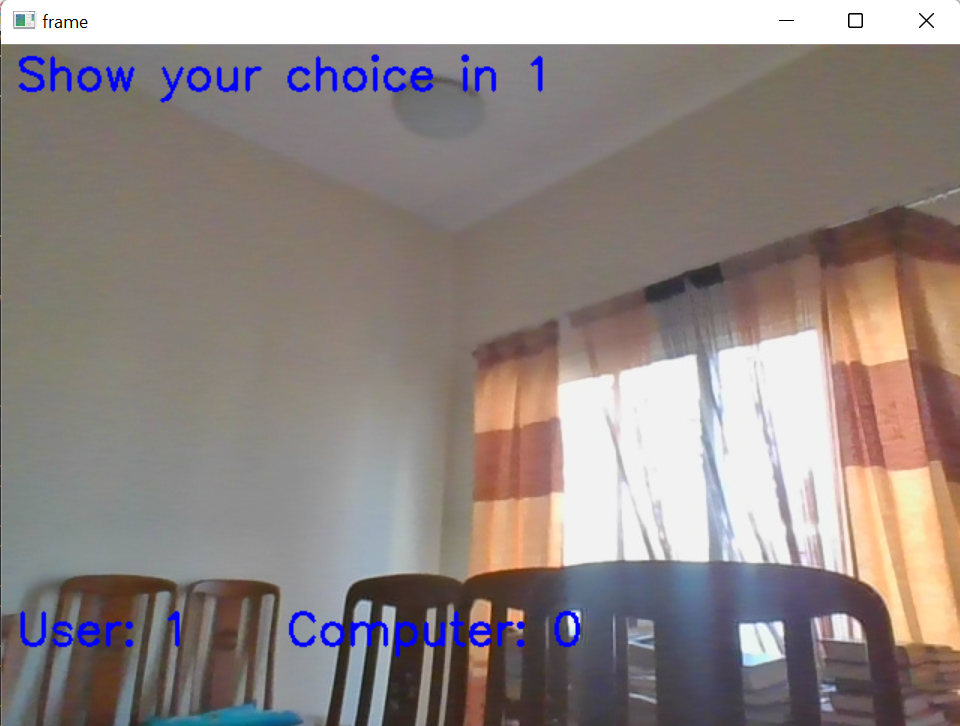
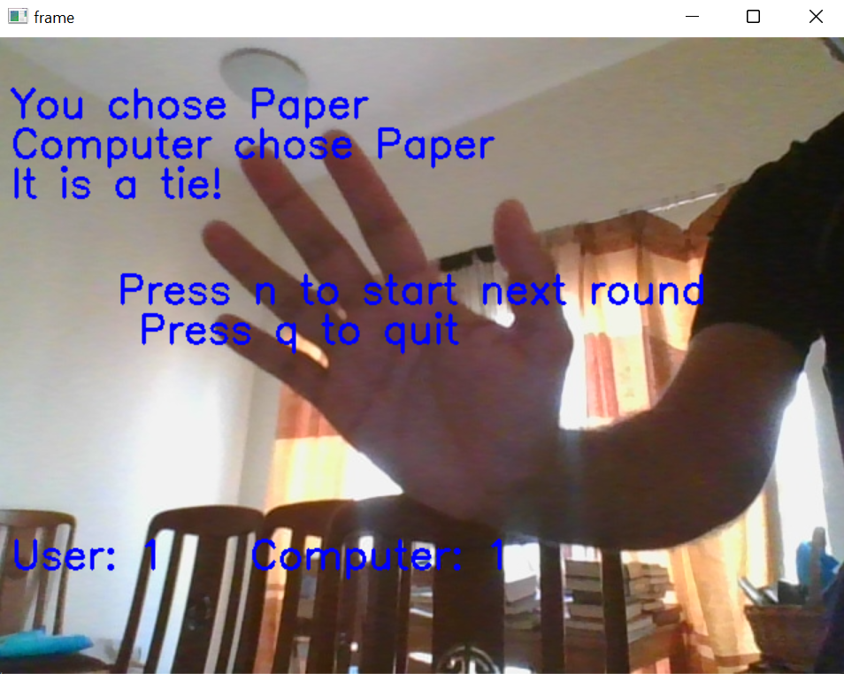

# computer-vision-rock-paper-scissors

## Milestone 2

Created a computer vision model using Teachable-Machine to identify hand gestures of rock, paper and scissors. The model will be used to create a program to play rock,paper, scissors against the computer.

- With Teachable-Machine, the dataset for the different classes can be created by recording using the webcam or uploading the image files.
- Created four classes - Rock, Paper, Scissors and Nothing(images with no hand)
- Downloaded the tensorflow keras model in .h5 format and the labels textfile

## Milestone 3 and 4

- Created a conda environment with required libraries: opencv-python, tensorflow, ipykernel
- Created function get_computer_choice to randomly select a choice for the computer
- Created function get_user_choice to ask user for their choice
- Created function play to play the game

## Milestone 5

- Created a function to predict the option shown by user to webcam
- Show countdown to let user know when to show their hand
- Repeat the game till the computer or user wins 3 rounds

### Game screenshots

